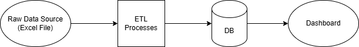

# 20260505-DE5M5

A library wants to improve their current quality analysis, as manually
completing the task takes too much time and is less reliable. They are
looking for a more efficient way to filter data using Python and
automation. They have heard of a tool called Azure DevOps and want to
apply it to their process. 

## High Level Architecture

## User Stories
- As a user I want to be able to filter data so I can complete quality analysis
- As a user I want the process to be simple and automated
- As a user I only want to be able to view or filter data that I have the relevant permissions for
- As a user I want to be able to clear filters in case I make a mistake

## Delivery Plan
### Prototype App
- Perform basic analysis of raw data
- Identify data structure and standardise as schema
- Create randomised data using schema, introduce deliberate errors for testing
- Create Python script that can test against schema and handle errors
- Transform test data into acceptable standard
- Load test data into database
- Test for RBAC, ensure only authorised users can load data into db
- Test for fail cases of load stage and handle
- Test data access is relevant to user (read/write access)
- Create Python application to load data and apply filters as required
- Test filters and access as expected

### Build and Test
- Implement Azure DevOps, ensure relevant redundancies and scaling
- Implement Version Control using Git
- Implement ETL scripts from prototype into CI/CD pipeline
- Implement testing scripts from Prototype into CI pipeline
- Run against test data, ensure failures are picked up and handled accordingly
- Test builds against AC and User Stories
- Gain feedback and adjust as necessary

### Deploy
- Deploy solution, ensure monitoring alerts are setup