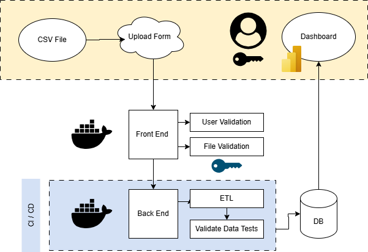
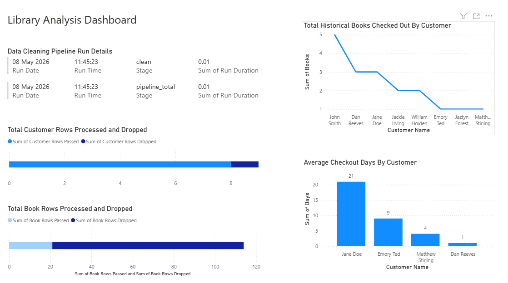

# Library System
A complete library data system to allow quality analysis using PowerBI Dashboards.

## Table of Contents
- [Overview](#overview)
- [Architecture](#architecture)
- [Dashboard](#dashboard)
- [Risks & Issues](#risks--issues)
- [Documentation](#documentation)

## Overview
A containerised Python ETL pipeline that cleans and enriches library data 
and outputs metrics for analysis in PowerBI.

## Architecture

User uploads CSV file via web based application hosted in a Docker container.
Back end Docker container runs the ETL pipeline and outputs cleaned data.
PowerBI connects to the output folder and presents the dashboard.

## Dashboard

## Risks & Issues
| Risk | Impact | Mitigation |
|------|--------|------------|
| SQLite not suitable for concurrent users | High | Migrate to PostgreSQL |
| No pipeline scheduling | Medium | Add cron or Airflow |
| Container fails mid pipeline run | High | Add restart policy in Dockerfile |

## Documentation
Detailed user guide and troubleshooting.
Link to wiki...

## Upgrade path
To maximise availability and scaling abilities, this pipeline could take advantage of implementing Docker Swarm.

If one container fails, Swarm automatically restarts on another container without intervention required.

If the library grows and more users begin uploading files, Swarm can spin up replica containers to accomodate.

When a pipeline update is pushed, Swarm can manage a rolling update one container at a time to ensure zero downtime.

Centralised control across all nodes from a single manager.